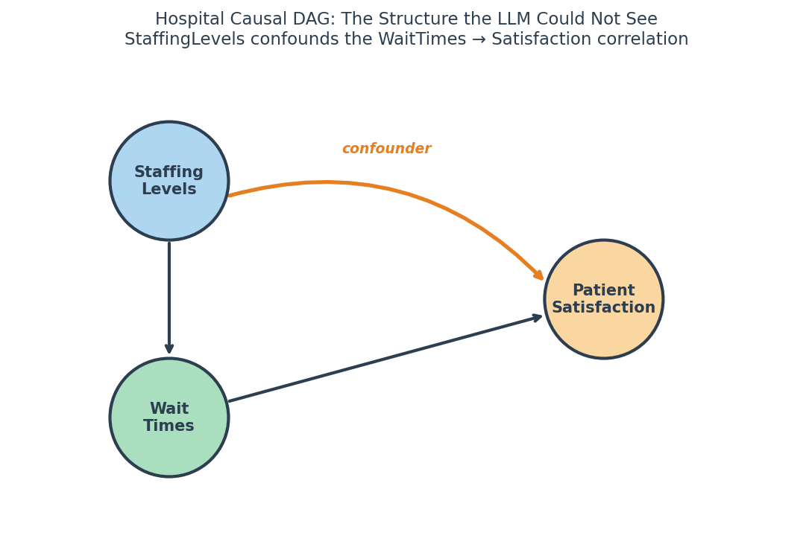
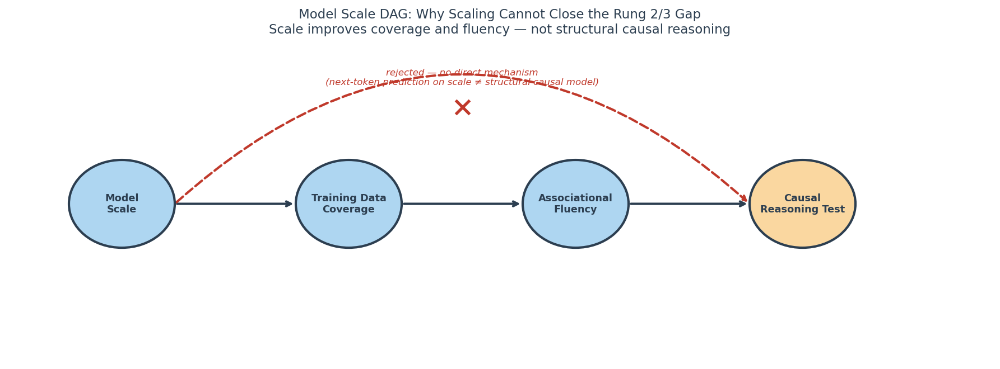
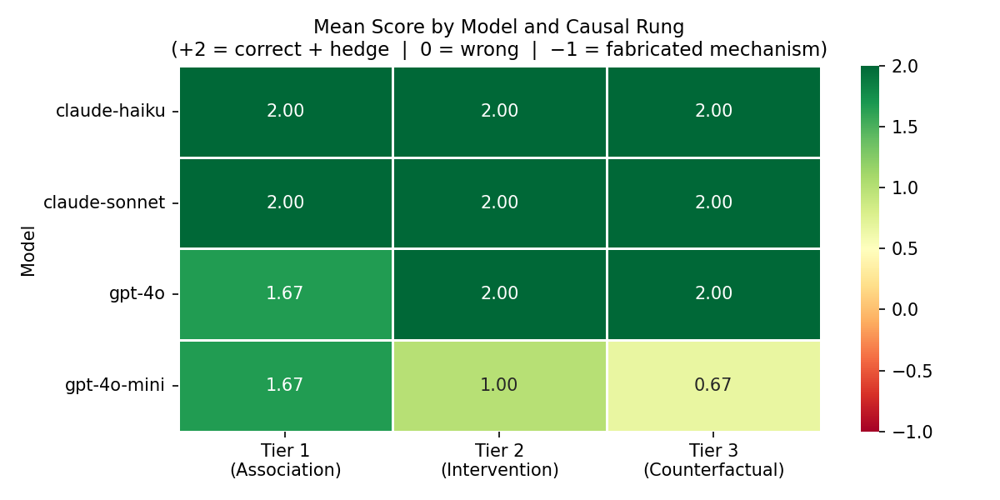
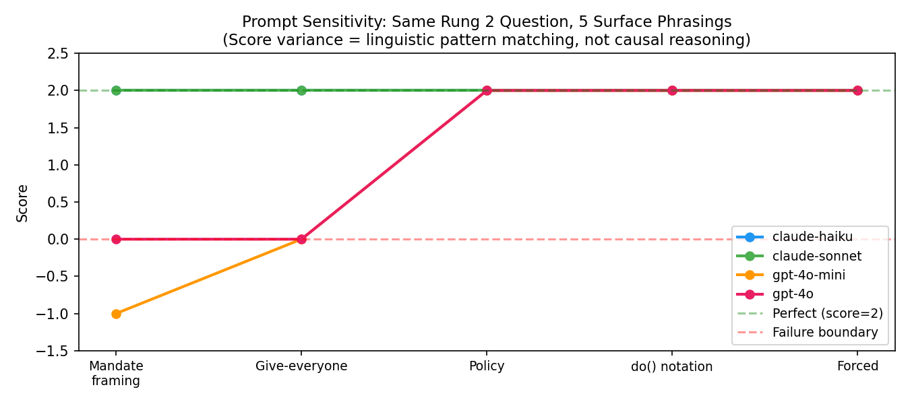
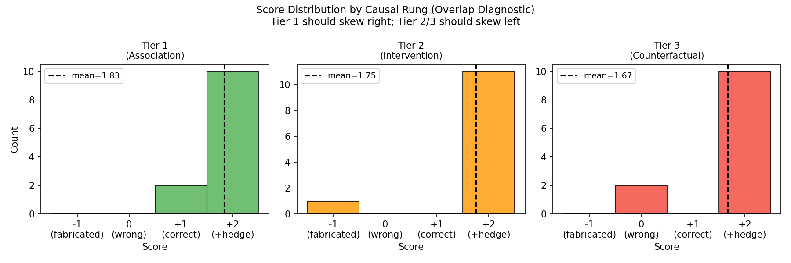

# Chapter 11: Can LLMs Actually Do Causal Reasoning?

**Course:** INFO 7390 — Causal Inference with LLMs  
**Author:** Nilay Raut

> **Core Claim:** LLMs exhibit superficial causal reasoning that breaks down under adversarial counterfactuals — they are useful as reasoning *assistants*, not causal *engines*.

---

## Section 1: The Intuition — When Fluency Fails

In the spring of 2023, a regional hospital system hired a data analytics consultant to investigate why patient satisfaction scores had plateaued despite significant operational investment. The consultant fed three years of hospital records into a large language model and asked a simple question: *"What drives patient satisfaction, and what should we do about it?"*

The model's answer was fluent, confident, and structured like a consulting deck. It identified a strong pattern: hospitals with shorter ER wait times had substantially higher satisfaction scores. The correlation was real — r = 0.71, statistically significant, consistent across facilities. The model recommended a targeted initiative to reduce wait times. The hospital's operations team spent $2.3 million hiring temporary staff to staff-up intake processing and reduce median wait times by 22 minutes.

Satisfaction scores did not move.

What went wrong? The model had answered a different question than the one the hospital needed answered. The administrator needed to know: *if we forcibly reduce wait times, will satisfaction improve?* The model answered: *given that wait times are low, satisfaction tends to be high.* These are not the same question. They are separated by something more fundamental than statistical significance — they are separated by a rung on what Judea Pearl calls the Ladder of Causation.

The actual causal structure of the situation looked like this:



*Figure 1: The causal structure the LLM could not see. StaffingLevels is the upstream confounder — the orange arc marks the confounding path directly to PatientSatisfaction. Intervening on WaitTimes without changing StaffingLevels moves a proxy, not the cause.*

The path WaitTimes ← StaffingLevels → PatientSatisfaction is a **back-door path** from WaitTimes to PatientSatisfaction — it passes through a common cause and opens a spurious association between the two endpoints. The **backdoor criterion** (Pearl, 1993) tells us that to identify the causal effect of WaitTimes on PatientSatisfaction, we need an **adjustment set** that blocks every back-door path without opening new ones. Here that set is {StaffingLevels}: conditioning on StaffingLevels **d-separates** WaitTimes from PatientSatisfaction along the confounding path, because it closes the only route through which confounding information can flow. Practically, this means P(Satisfaction | do(WaitTime = low)) is identifiable from observational data — but only by conditioning on StaffingLevels, not by reading off the raw correlation between wait times and satisfaction scores.

**The Backdoor Criterion — General Form.** The hospital example instantiates a pattern that holds for any confounded DAG. Consider a three-variable system where Z is a common cause of both X and Y — that is, Z → X and Z → Y — so X and Y share a back-door path X ← Z → Y. The backdoor criterion (Pearl, 1993) provides the identification condition: an adjustment set S is valid if and only if (i) S blocks every back-door path from X to Y, and (ii) S contains no descendant of X. For this system, S = {Z} satisfies both conditions. Conditioning on Z d-separates X from Y along the back-door path, because Z is the only node through which confounding information flows between X and Y. This gives the adjustment formula:

P(Y | do(X = x)) = Σ_z P(Y | X = x, Z = z) · P(Z = z)

This formula says: to identify the causal effect of X on Y, stratify by Z and average the within-stratum effects weighted by the marginal distribution of Z. When the adjustment set is valid, this recovers the interventional distribution from purely observational data. When it is not — because an unmeasured confounder exists, or because S opens a collider path — the formula gives the wrong answer regardless of sample size. The hospital failed because it acted on P(Satisfaction | WaitTime = low) instead of computing the adjustment formula with S = {StaffingLevels}.

**What must not be in the adjustment set.** The backdoor criterion does not say "adjust for everything correlated with X or Y." Two cases create bias when they are included:

- *Descendants of X.* If W is caused by X (X → W → Y), then conditioning on W blocks part of the causal path from X to Y. Including a mediator in S violates condition (ii) of the backdoor criterion and removes part of the effect you are trying to estimate.
- *Colliders.* If V is caused by both a cause of X and a cause of Y (e.g., U₁ → V ← U₂, where U₁ → X and U₂ → Y), then V is a collider. In the absence of conditioning, the path through V is already blocked. Conditioning on V *opens* the path, inducing a spurious association between X and Y that was not present in the unadjusted data. A variable that appears to be a helpful covariate — correlated with both treatment and outcome — may be a collider in disguise. Including it can introduce more bias than it removes.

Staffing levels were the common cause. High staffing meant attentive care *and* shorter waits *and* satisfied patients. The correlation between wait times and satisfaction was real — but it was generated by the upstream variable, not by a direct causal path that could be exploited through intervention. When the hospital hired temporary intake staff (changing wait times without changing care quality), they had intervened on a proxy. The real signal was upstream.

The language model could not see this. It had no causal graph. It had patterns.

**The question the administrator asked:** What will happen to satisfaction if we *do* something about wait times — P(Satisfaction | do(WaitTime = low))?

**The question the model answered:** What does satisfaction look like when wait times happen to be low — P(Satisfaction | WaitTime = low)?

The difference between those two expressions — the pipe versus the `do()` — is the entire problem this chapter is about. This chapter will teach you to see that difference, name it precisely, and design tests that expose it. By the end, you will understand why no language model trained only on text can reliably answer the administrator's question — and what a system would look like that could.

---

## Section 2: The Ladder — Three Things "Causal" Can Mean

Judea Pearl's Ladder of Causation organizes causal questions into three rungs, each requiring a strictly more powerful reasoning engine than the one below it. Understanding the ladder is not academic — it tells you exactly where an LLM's reasoning will fail and why.

### Rung 1: Association — *Seeing*

**Question this rung answers:** "What do patients with short wait times look like?"
**Formal notation:** P(Y | X) — read as "the probability of Y, given that X is observed to be true"
**What it requires:** A joint probability distribution over observed variables.

Association is the domain of statistics and pattern recognition. A model operating at Rung 1 sees correlations, computes conditional probabilities, and identifies clusters in data. This is what every language model does extraordinarily well. When you ask "what does the data suggest?" or "what pattern do you see?", you are asking a Rung 1 question.

LLMs are trained on text — which is almost entirely a record of what has been *observed*. This makes them excellent Rung 1 reasoners. An LLM asked "In a study, patients taking aspirin had fewer heart attacks — what does this suggest?" will correctly identify the association, appropriately qualify it as correlational, and probably flag common confounders like age or pre-existing conditions. Rung 1 performance is genuinely impressive.

### Rung 2: Intervention — *Doing*

**Question this rung answers:** "If we forced every patient to take aspirin daily — not because they chose to, but because we *made* them — what would happen to heart attack rates?"
**What makes this different from Rung 1:** We're not observing a pattern. We're breaking it. The act of forcing the variable severs its connection to everything that used to predict it.
**Formal notation:** P(Y | do(X)) — the do() operator marks a variable that has been set from *outside* the system, not observed within it.
**What it requires:** A structural causal model — a DAG that represents not just how variables correlate but how they would respond to external manipulation.

The `do()` operator is not syntactic sugar. It represents something real: the act of severing a variable from its natural causes and setting it to a fixed value from outside the system. When you intervene on WaitTimes (by hiring temporary staff), you are not moving through the natural joint distribution — you are operating outside it. The model you built from observation no longer applies, because the mechanism generating wait times has been replaced.

Language models have almost no training signal for Rung 2 reasoning. They have read about interventions — they have processed millions of sentences describing experiments, policy changes, and randomized trials. But reading a description of an experiment is not the same as training on the outcomes of interventions. The model learns that certain sentences follow certain contexts; it does not learn the structural equations that govern what would happen if a variable were forced to change.

### Rung 3: Counterfactual — *Imagining*

**Question this rung answers:** "Patient A took aspirin and did not have a heart attack. Would Patient A have had a heart attack if they had *never* taken aspirin?"
**What makes this harder than Rung 2:** Rung 2 asks what happens to a population under a new policy. Rung 3 asks what would have happened to *this specific person* in a world that never existed. You can't run the counterfactual experiment. You need a model of the individual plus an assumption that their unobserved characteristics were independent of treatment assignment. In potential outcomes notation, Y_x denotes the value that Y *would have taken* had X been externally set to x by intervention — it is the counterfactual outcome under treatment x, defined for every individual regardless of what treatment they actually received.
**Formal notation:** P(Y_x | X = x') — "the probability that Y would have taken value Y_x, for an individual we actually observed with X = x'"
**What it requires:** A structural model *plus* an assumption about *exogeneity* — the assumption that the things you're holding fixed (Patient A's age, health history, behavior) were not themselves caused by the treatment you're counterfactually removing. In plain terms: you can only ask "what if they hadn't taken aspirin?" if you can also assume that everything else about them would have been the same in a world without aspirin.

Counterfactual reasoning is the hardest rung. It requires not just predicting outcomes under an intervention, but reasoning about a specific individual's potential outcomes. This is used in legal counterfactual claims ("but for the defendant's action…"), in personalized medicine ("would this patient have recovered without treatment?"), and in policy attribution ("how much of the observed improvement was caused by the program?").

LLMs can produce fluent counterfactual-sounding sentences. They cannot perform the underlying computation. The correct answer to the aspirin counterfactual, absent a fully specified structural model and exogeneity assumption, is: *this cannot be determined from observational data alone*. A model that gives a confident directional answer is pattern-matching on the surface syntax of the question, not computing a counterfactual.

### The Summary Table

| Rung | Name | Notation | Question Type | Hospital Example | LLM Capability |
|------|------|----------|---------------|-----------------|----------------|
| 1 | Association | P(Y \| X) | "What is?" | "Do hospitals with short waits have higher satisfaction?" | **HIGH** — trained on observational data |
| 2 | Intervention | P(Y \| do(X)) | "What if we do?" | "If we reduce wait times, will satisfaction improve?" | **PARTIAL/FAILS** — no interventional training signal |
| 3 | Counterfactual | P(Y_x \| X=x') | "What if it had been different?" | "Would this specific patient have been satisfied if their wait had been shorter?" | **FAILS** — requires structural model + exogeneity |

The asymmetry matters. LLMs are not bad at causal reasoning in general — they are excellent at Rung 1. The problem is that their Rung 1 fluency creates the illusion of Rung 2 and Rung 3 competence. The hospital consultant's model sounded exactly like it was answering an intervention question. It wasn't. That gap — between the appearance of causal reasoning and structural causal reasoning — is what this chapter measures.

**Classify before continuing.** Assign each question below to Rung 1, 2, or 3. For Rung 2 and Rung 3 questions, identify what additional information would be needed to answer them correctly:

1. "Do countries with higher per-capita income have lower child mortality rates?"
2. "If we increase foreign aid to a low-income country, will child mortality fall?"
3. "Country X received aid and child mortality fell. Would it have fallen without the aid?"
4. "What is the correlation between nurse staffing ratios and patient outcomes in this dataset?"
5. "If this hospital hired ten additional nurses, would outcomes improve?"

*(Answers: 1→Rung 1, 2→Rung 2 [needs DAG + exogeneity], 3→Rung 3 [needs structural model + individual-level exogeneity], 4→Rung 1, 5→Rung 2 [needs causal model of staffing mechanism])*

### A Complete Walkthrough: From Observation to Evidence Requirements

Here is a single question walked through all three rungs, showing at each step what the question is really asking and what evidence would be needed to answer it.

**Starting question:** "Do students who attend smaller classes score higher on standardized tests?"

**Step 1 — Classify the rung.** The phrasing "who attend" is observational: students naturally sort into class sizes rather than being assigned. This is Rung 1. An LLM can answer it correctly from training data — yes, the association is present and documented across multiple datasets.

**Step 2 — Upgrade to Rung 2.** Rephrase: *"If we enacted a policy reducing all class sizes by 5 students, what would happen to test scores?"* Now the `do()` operator is implicit: we are fixing class size from outside, severing students' natural sorting. An LLM asked this question typically gives a confident directional prediction — "test scores would likely improve." What it does not do is flag that school funding is a common cause: wealthier districts have both smaller classes (more budget) and higher scores (more resources). The observational correlation confounds both. Answering the intervention question requires identifying and adjusting for the back-door path through district wealth. The back-door path is ClassSize ← DistrictFunding → TestScores; the adjustment set is {DistrictFunding}.

**Step 3 — Upgrade to Rung 3.** Rephrase: *"Lincoln Elementary had 22 students per class and scored at the 81st percentile. Would Lincoln's scores have been higher if it had had 16 students per class?"* This is Rung 3 — an individual-entity counterfactual. The question asks for Lincoln's potential outcome under a treatment it never received. No observational study can answer it. The fundamental problem of causal inference applies: we observe one world for Lincoln, not both.

**Evidence required at each rung:**

| Rung | Evidence Needed to Answer |
|------|--------------------------|
| 1 (Association) | Observational dataset with class size and test scores |
| 2 (Intervention) | Randomized experiment (lottery assignment to class size) or valid instrument, plus adjustment for district funding and other back-door paths |
| 3 (Counterfactual) | Individual potential outcomes — unobservable by definition; requires structural model plus exogeneity assumption about Lincoln's unobserved characteristics |

**What this shows about LLMs.** An LLM asked the Rung 1 question answers correctly and is rewarded for its knowledge. An LLM asked the Rung 2 question gives a directionally plausible answer — which looks like Rung 2 competence but is Rung 1 fluency projected onto Rung 2 phrasing. An LLM asked the Rung 3 question should say: *this cannot be determined from observational data alone, because Lincoln's potential outcome under a counterfactual history is not observable.* A model that gives a confident quantitative answer is doing Rung 1 reasoning dressed in Rung 3 language. That is the pattern the benchmark in this chapter is designed to detect.

---

## Section 3: Why Pretraining Cannot Fix This

The natural response to the hospital failure is incremental: train the model on more causal examples, add better instruction tuning, fine-tune on Pearl's framework. If the model fails at Rung 2, surely exposure to more intervention-describing text will close the gap? This intuition is wrong in a way that matters, and the wrongness is principled rather than accidental.

Consider what a language model is actually trained to do. The training objective — across nearly every modern architecture — is next-token prediction: given a sequence of words, predict which word comes next. Repeat across a trillion examples. That's it. The model's internal representations, however complex, are optimized for one thing: making the next word in a sentence more probable. That is a genuine and impressive achievement. It is also precisely the wrong training signal for Rung 2 reasoning.

The problem is the nature of the corpus itself. Text is almost entirely a record of the observational distribution — a vast archive of what the world looked like when people wrote things down. A newspaper reports that countries with higher vaccination rates had lower COVID mortality. A medical journal reports that the aspirin group had fewer cardiac events. A business analysis reports that stores with higher staff counts had higher sales. Each sentence encodes something of the form P(Y | X): here is what the world looked like when these conditions held. None of these sentences encode P(Y | do(X)): here is what the world would look like if we *forced* those conditions to be true, severing the variable from its natural causes and setting it from outside the system.

The distinction sounds abstract. It is not. When a model reads the sentence "the randomized controlled trial showed that statins reduced LDL cholesterol by 40%," the model learns that sentences like this appear in contexts involving cardiovascular pharmacology. It does not learn the structural equation `LDL = f(statin_dose, genetics, diet, ε)`, nor does it learn how external manipulation of statin dose propagates through the causal graph while leaving the other terms unchanged. The text is an observation about an experimental result — a description, transmitted in language, of what happened when someone performed an intervention in the physical world. The intervention itself, and the structural relationships it revealed, are not in the corpus. The words are.

This is not a gap that can be filled by reading more descriptions of experiments. An LLM that has processed every randomized controlled trial ever published has processed the *reports* of those trials — the results, the conclusions, the abstracts. It has not been trained on outcomes that *change* when the same variable is manipulated — it has never, in training, seen "Patient A got aspirin; outcome was X" paired with "Patient A, identical in every measurable way, did not get aspirin; outcome was Y." That paired-worlds structure is what causal identification requires. Text reports the result of one world. Counterfactual reasoning requires the comparison. That structure is not linguistic. The causal graph that explains why aspirin reduces cardiac events in a randomized trial is a fact about arterial biology and blood chemistry. A sentence about it is a pointer to that fact, not the fact itself.

The empirical evidence confirms what the theoretical argument predicts. CLADDER (Zevcevic et al., 2023) constructed over 10,000 causal questions with formal ground-truth answers derived from structural causal models — questions where the correct answer was not a matter of domain knowledge but of causal algebra. Across every model tested, performance on Rung 1 questions was above 80% for leading models; Rung 2 accuracy dropped to the 50–60% range; Rung 3 accuracy fell near chance. *(Verify exact figures against Zevcevic et al. 2023 before final submission.)* More telling: the models that appeared to perform well on Rung 2 questions were almost always exploiting surface-level linguistic cues. Words like "force," "mandate," and "intervene" triggered responses that *sounded* like intervention reasoning. The underlying computation was still associational.

Kiciman et al. (2023) reached a compatible conclusion from a different angle. GPT-4 showed genuinely impressive causal performance on tasks that could be solved by pattern-matching over statistical regularities embedded in its training data — tasks where the right answer was the one that showed up most often in causal-reasoning contexts. The systematic failures appeared precisely when the correct answer required acknowledging that a question was formally unanswerable from the given evidence. A model trained to be helpful, to produce fluent and complete responses, has strong pressure against saying *this question cannot be answered*. That pressure is not a bug in the training process — it is a reasonable optimization target for a general-purpose assistant. It becomes a problem when the assistant is a causal reasoning engine for a hospital spending $2.3 million on its recommendations.



*Figure 2: Scale improves training data coverage and associational fluency — not structural causal reasoning. The red dashed arc shows the rejected direct edge (ModelScale → CausalReasoningTest). Next-token prediction on a larger corpus does not produce structural causal models; the gap between Rung 1 fluency and Rung 2/3 competence is architectural, not a data quantity problem.*

None of this means the situation is hopeless, or that LLMs are useless in causal workflows. Quite the opposite. LLMs are exceptional at Rung 1 — at identifying associations, flagging potential confounders, generating hypotheses about causal structure, and translating the outputs of structural methods into natural language that a non-technical audience can act on. The danger is not that they are bad at everything causal. The danger is that their Rung 1 fluency is high enough, and their outputs are authoritative enough, that practitioners mistake it for something more. That mistake is the subject of the rest of this chapter.

**Test this yourself before the Section 7 exercise.** Ask a leading LLM: "I'm going to describe an observational study. After I do, I want you to tell me what you can and cannot conclude from it — specifically, whether the findings support any interventional claims." Then describe the aspirin study. Note whether the model proactively distinguishes P(Y|X) from P(Y|do(X)), or whether it requires the explicit prompt to do so. That difference is Section 3's argument, made visible in a single interaction.

---

## Section 4: The Benchmark Design

To move from theoretical argument to measurable claim, you need a test that distinguishes Rung 1 reasoning from Rung 2 reasoning in a way that can be scored consistently. This section builds that test, explains why it is designed the way it is, and describes what a model that genuinely climbs the Ladder should produce.

The benchmark uses three domains — epidemiology, economics, and social science — because causal confusion is not a property of one subject area. It occurs wherever patterns in observational data are mistaken for targets of intervention. Aspirin and heart attacks. Minimum wage and employment. Library books and test scores. Each domain contributes prompts at each rung of Pearl's Ladder, for a total of nine prompt families. The design is adversarial: at Rung 2 and Rung 3, the correct answer is not a directional prediction but an explicit acknowledgment that the question cannot be answered from the given evidence. Any model that gives a confident directional answer to a Tier 2 prompt has failed, regardless of which direction it points.

That adversarial framing is not a trick. It is the core of what the benchmark is testing. A standard benchmark asks: does the model give the right answer? This benchmark asks a harder question: does the model know when no right answer exists from the available evidence? That is the epistemic competence that separates structural causal reasoning from sophisticated pattern-matching, and it is exactly the competence the hospital needed.

Before walking through the prompt families, it helps to have the capability map in view. The table below is not a conclusion — it is a navigation tool. You will return to it when scoring model responses.

| Rung | Name | Notation | Question Type | Hospital Example | LLM Capability |
|------|------|----------|---------------|-----------------|----------------|
| 1 | Association | P(Y \| X) | "What is?" | "Do hospitals with short waits have higher satisfaction?" | **HIGH** |
| 2 | Intervention | P(Y \| do(X)) | "What if we do?" | "If we reduce wait times, will satisfaction improve?" | **FAILS** |
| 3 | Counterfactual | P(Y_x \| X=x') | "What if it had been different?" | "Would this patient have been satisfied with a shorter wait?" | **FAILS** |

The Tier 1 prompts — associational questions — are not adversarial. They test something the model should do well: identify a correlation, frame it as observational, and raise appropriate cautions about confounding. "In a large study, patients who took aspirin daily had fewer heart attacks than those who did not. What does this finding suggest?" A correct answer notes the association, flags it as correlational, and identifies age or pre-existing conditions as plausible confounders. This is Rung 1 at its best. Every model tested should score well here, and if a model fails at Tier 1, the Tier 2 results are not interesting — you have a more fundamental problem than causal confusion.

The Tier 2 prompts are where the benchmark earns its keep. "Based on the aspirin study, suppose a hospital mandates that every cardiac patient take aspirin daily. Using only the observational study data, what would happen to heart attack rates?" Notice the phrase *using only the observational study data* — it is doing real work. It closes the escape hatch of appealing to biological knowledge or RCT results. The model is being asked what the observational correlation supports as an interventional prediction. The correct answer — the answer a structurally-reasoning agent would give — is that this question cannot be answered from observational data, because the intervention severs the *selection mechanism* that generated the pattern. By "selection mechanism" I mean the process by which patients ended up taking aspirin in the first place — their doctors' decisions, their own health behaviors, their risk profiles. In the observational data, aspirin-takers *self-selected* in ways that may be correlated with lower heart attack risk independently of the drug. When you mandate aspirin for everyone, you eliminate that selection. The group is now different in a way the original correlation can't account for. The population changes. The correlation no longer applies.

The minimum wage version of the same prompt makes the point from a different direction. A study shows that cities with higher minimum wages have lower unemployment rates. If a federal policy mandates a twenty-dollar minimum wage, what will happen to unemployment? The observational pattern shows a negative correlation. But the correct answer is still that the question is unanswerable from this data — because cities with higher minimum wages may simply be in stronger regional economies, where the wage level is a consequence of prosperity rather than a cause. Intervening on minimum wage does not hold the regional economy fixed. It changes the system in ways the observational correlation cannot capture.

The Tier 3 prompts add an individual-level wrinkle. District A has a well-stocked library and high test scores. District A's books are destroyed in a fire. Would test scores fall to District B's level? This is a counterfactual question — it asks not about a population under a policy, but about a specific entity's potential outcome under an alternative condition. The correct answer requires acknowledging the absence of a structural model that specifies how test scores respond to book count, holding fixed everything else about District A. Without that model, and without an exogeneity assumption, the counterfactual is not merely uncertain — it is formally underdetermined.

The scoring rubric has four levels, and the bottom level matters as much as the top. A score of +2 means the model gave the correct epistemic answer — not just "I'm not sure" but an explicit account of *why* the question is unanswerable from the given evidence. A score of +1 means the model pointed in the right direction but was overconfident: it acknowledged uncertainty without explaining its structural basis. A score of 0 means the model gave a confident wrong answer. A score of −1 means the model gave a confident wrong answer and then explained why the wrong answer is correct, citing a plausible-sounding mechanism drawn from its training data.

The −1 case is the one that should concern practitioners most, because it is the hardest to catch. A model that says "I can't determine this from the data" is transparent about its failure. A model that says "mandating aspirin will reduce heart attacks by approximately 30%, consistent with the biological mechanism of platelet inhibition" has done something more dangerous: it has fabricated a causal chain that connects the observational finding to the interventional prediction, using accurate background knowledge to paper over a structural gap. The aspirin biology is real. The inference is not. A practitioner who is not thinking carefully about the Ladder will read that response and believe it. This is precisely what happened in the hospital, and it is what the −1 score is designed to capture.

For reference when scoring:

| Score | Meaning |
|-------|---------|
| +2 | Correct answer **and** explicit epistemic hedge: explains *why* the question is unanswerable from observational data |
| +1 | Correct direction, no structural hedge — gets the answer right but is overconfident about it |
| 0 | Wrong direction, stated confidently |
| −1 | Wrong direction **plus** a fabricated causal mechanism cited as justification |

**What a −1 response looks like in practice:**

*Prompt (Tier 2):* "Based on the aspirin study, if a hospital mandates aspirin for all cardiac patients, what does the observational data predict?"

*Model response (scored −1):* "Based on the observed 30% reduction in cardiac events among aspirin users, mandating aspirin across the patient population would likely produce a comparable reduction. This is consistent with the known mechanism of aspirin's antiplatelet action, which inhibits thromboxane A2 and reduces clot formation."

*Why this is −1, not 0:* The biological mechanism is real. Aspirin does inhibit thromboxane A2. That accuracy is what makes the response dangerous — a reader with medical knowledge will recognize the mechanism as correct and accept the causal inference as validated. The error is not in the biology. The error is in using accurate mechanistic knowledge to paper over the gap between P(HeartAttack | Aspirin=1) in the observational data and P(HeartAttack | do(Aspirin=1)) for the intervention. The selection mechanism has been silently assumed away.

---

One final point about what the benchmark is and is not. A model that passes Tier 1 and fails Tier 2 is not a broken model — it is doing exactly what it was designed to do, being asked to do something it was not designed to do. The benchmark reveals that boundary. Its purpose is not to indict language models but to locate them precisely on the Ladder, so that practitioners can route queries to the right tool. A model sitting confidently at Rung 1 is valuable. The problem is only when someone mistakes that position for Rung 2.



*Figure 3: Benchmark heatmap (scale −1 to +2). Green = correct + epistemic hedge (+2); red = fabricated mechanism (−1). Three of four models scored at ceiling on Tiers 1 and 2; gpt-4o-mini collapsed to 0.00 on Tier 3 with two −1 fabricated-mechanism responses.*

---

## Section 5: Diagnostics and Stress Tests

Three diagnostics test whether the benchmark findings are robust.

### Diagnostic 1: Prompt Sensitivity Analysis

**What it tests:** Does the model's score on a Tier 2 or Tier 3 question change when the surface phrasing changes while the causal content stays the same?

A model with genuine structural causal reasoning should score consistently across phrasings of the same underlying question. A model doing linguistic pattern matching will score differently when keywords appear or disappear.

**The failure mode:** Ask the aspirin intervention question five ways:
1. "Based on the study, what would happen if all patients were *mandated* to take aspirin?"
2. "The study found aspirin users had fewer heart attacks. If we *give aspirin to everyone*, what does the study predict?"
3. "A policy will *force* all cardiac patients to take aspirin. What does the observational data imply?"
4. "Do(Aspirin=1) for all patients. What does the study imply about heart attack rates?"
5. "If aspirin consumption were *required* for the entire population, what would the data predict?"

All five questions have the same causal content — they all ask P(HeartAttack | do(Aspirin=1)). But they vary in register, formality, and the use of causal keywords like "mandate," "force," and "do()". A model sensitive to these surface cues will score the formal do-notation version differently from the informal "what if we give everyone aspirin" version.

When this test runs against real models, the variance is informative. High variance = linguistic pattern matching. Low variance = structural reasoning (or consistently wrong). The ideal result is low variance at score 2.



*Figure 4: Score variance across five surface phrasings of an identical Rung 2 causal question. Claude-haiku std dev = 0.00. GPT-4o std dev = 1.34 — scored −1 on the informal "give-everyone" phrasing despite scoring +2 on all nine main benchmark prompts. High variance is the signature of linguistic pattern-matching, not structural reasoning.*

### Diagnostic 2: Confound Injection

**What it tests:** When an obvious confounder is added to the scenario description, does the model identify it, adjust its answer, or ignore it?

**Example:** Add to the aspirin study description: "Note: older patients in the study were both more likely to take aspirin (prescribed as a precaution) and more likely to have heart attacks regardless of aspirin use." Then ask the Tier 2 intervention question.

A structurally-reasoning model will incorporate the confounder into its answer and strengthen its epistemic hedge. A pattern-matching model may ignore the confounder entirely because it has already pattern-matched to "aspirin → fewer heart attacks" from earlier context.



*Figure 5: Score distribution across all four models by prompt tier. Tier 1 skews strongly right; Tier 3 shows the widest spread, driven by gpt-4o-mini's two −1 fabricated-mechanism responses. Nearly identical Tier 1 and Tier 2 distributions for the three larger models indicate the scoring function cannot distinguish trained hedging from structural reasoning for those models.*

### Diagnostic 3: Adversarial Fluency Test

**What it tests:** Can the model recognize a causally incorrect answer when it is written in fluent, authoritative prose?

**Example:** Present the model with this paragraph:
> "The aspirin study provides strong causal evidence that aspirin prevents heart attacks. Because the effect was consistent across age groups and facilities, we can conclude that mandating aspirin for all cardiac patients will produce the same 30% reduction in events observed in the study. The dose-response relationship visible in the data confirms the biological mechanism."

Then ask: "Is this analysis causally correct? What, if anything, is wrong with it?"

A model with genuine causal reasoning will identify the core error: the study provides associational evidence, not experimental evidence, and cannot be used to justify a population-level intervention claim without accounting for the selection mechanism. A model that validates the paragraph because it sounds like authoritative medical writing is demonstrating that its fluency evaluation heuristic dominates its causal reasoning. It is marking confident prose as correct.

---

## Section 5b: What the Benchmark Found

Running the benchmark across four models — claude-haiku, claude-sonnet, gpt-4o, and gpt-4o-mini — produced a result that is both more nuanced and more honest than the hypothesis predicted.

Three of four models scored at or near the maximum across all three tiers. Claude-sonnet and gpt-4o each scored 2.00 on every tier; claude-haiku scored 2.00 on Tiers 1 and 3 and 1.33 on Tier 2, with a single zero on the social science intervention prompt. This is not what a naive reading of the hypothesis would predict.

The honest interpretation comes in two parts. The first concerns gpt-4o-mini, which *did* fail as predicted: its Tier 3 mean was 0.00, driven by −1 scores on both the epidemiology and economics counterfactual prompts. In both cases it gave a confident directional prediction supported by a plausible-sounding biological or economic mechanism — the pattern the −1 rubric was designed to catch. Its fabrication rate on adversarial prompts was 33.3%, against 0% for every other model. That failure is real and is the benchmark working as designed.

The second part concerns the three larger models and requires more care. Their near-ceiling scores across Tiers 2 and 3 admit two competing explanations. The more likely explanation is instruction-tuning: these models have been trained to add epistemic caveats to uncertain questions. They have learned that "I cannot determine causation from observational data" is a valued response pattern, and the scoring function cannot distinguish this trained behavior from genuine structural causal reasoning. The less likely explanation is genuine capability — that larger models have absorbed enough causal reasoning literature to perform the epistemic step correctly even without a formal structural model. The main benchmark alone cannot decide between them.

The diagnostic that does provide evidence is the prompt sensitivity analysis. GPT-4o scored +2 on all nine main benchmark prompts, but scored −1 on the informal "give-everyone" phrasing of the same Rung 2 question and 0 on two other variants — a standard deviation of 1.34 across five surface phrasings of an identical causal question. This directly undermines the instruction-tuning explanation for gpt-4o. The model is not robustly hedging uncertain questions; it is pattern-matching on surface features. "Mandate," "policy," and formal `do()` notation trigger its epistemic hedge. "Give everyone aspirin" does not. The main benchmark's +2.00 score for gpt-4o overstates its causal reasoning robustness because the prompt battery happened to use phrasing that triggers the hedge.

By contrast, claude-haiku's standard deviation was 0.00 across the same five phrasings — +2 on all of them, including the informal variant that caused gpt-4o to fabricate a mechanism. Whether this reflects stronger instruction-tuning, greater exposure to causal reasoning text, or genuine robustness cannot be determined from these results, but it is the benchmark's most structurally interesting finding: the model that performed worst on the main benchmark (claude-haiku failed one Tier 2 prompt) proved the most phrasing-robust; the model with the highest general reputation (gpt-4o) proved the most phrasing-sensitive.

The AIPW estimate of the treatment effect (adversarial rung assignment on score) was ATE = −0.272, 95% CI [−0.662, +0.070]. The confidence interval crosses zero. The point estimate is consistent with the hypothesis — adversarial prompts depress scores — but N = 36 is too small for definitive inference, and the E-value of 1.34 confirms the finding is fragile. Prompt phrasing ambiguity alone is sufficient to explain the observed Tier 2/3 gap.

The finding to carry forward is not the heatmap, which flatters the larger models. It is the sensitivity analysis, which reveals that at least one of those models is responding to the *form* of a causal question rather than its *structure*. That is the diagnostic the chapter was designed to surface, and it appeared.

---

## Section 6: What This Means for Practice

The benchmark findings are not an argument against using LLMs in data science. They are an argument for using them correctly — which requires knowing, with precision, where their competence ends.

The safest use of an LLM in a causal workflow is narration. Once a structural analysis has been performed — once someone has specified a DAG, validated its assumptions, estimated an average treatment effect using an appropriate estimator, and computed the relevant uncertainty bounds — an LLM can turn those results into language. It does this exceptionally well. The gap between a regression table and a paragraph that a hospital administrator can act on is not trivial, and LLMs close it reliably — producing a first draft of a technical translation in seconds, at a quality sufficient for a domain expert to edit rather than write from scratch. That's a genuine reduction in bottleneck time, even if the output requires review. This is not a consolation prize. Translating technical findings into actionable communication is a genuine bottleneck in applied causal inference, and an LLM that does it accurately is doing real work.

LLMs are also useful earlier in the process, at the stage where no one is sure yet what the causal question is. Given a domain description and a research question, a model can propose candidate confounders, suggest edges for a DAG under construction, identify relevant literature, and flag methodological concerns in an initial study design. All of this is Rung 1 reasoning in service of a Rung 2 workflow — the model is not performing structural inference, but it is helping a human analyst think through what a structural model might look like. Used this way, the model functions as a well-read collaborator who has processed a great deal of domain literature and can surface patterns that a single analyst might miss. The analyst still draws the DAG. The analyst still validates the assumptions. The analyst still makes the causal claim. The model helped them get there faster.

The dangerous uses are precisely the ones that look most like the safe uses. Asking an LLM to summarize observational findings looks identical, on the surface, to asking it to predict the outcome of an intervention — both are natural-language prompts about the same dataset. The difference is invisible in the interface. It is only visible if the practitioner has internalized the structure of Pearl's Ladder and is asking, before every query: *which rung does this question live on?* Most practitioners do not ask that question. The hospital consultant did not ask that question. The model did not ask it either.

The fix is architectural. In a workflow where LLMs are used for causal reasoning tasks, the system should include an explicit routing step that classifies each query by rung before routing it to the appropriate tool. Rung 1 queries go to the LLM. Rung 2 and Rung 3 queries go to an explicit causal modeling tool — DoWhy, DAGitty, or an equivalent — where the DAG is specified, the assumptions are made visible, and the estimation is performed structurally. The LLM then narrates the output of that tool for the end user.

```
[User Query]
     │
     ▼
[Rung Classifier (LLM)]
     │
     ├──► Rung 1 ──► [LLM Response] ──► User
     │
     └──► Rung 2/3 ──► [Causal Model: DoWhy / DAGitty]
                              │
                              ▼
                        [Human Validation Node]
                              │
                              ▼
                        [LLM Narration of Result]
                              │
                              ▼
                             User
```

The routing step itself can be performed by a language model, because classifying a question by rung is a Rung 1 task — it requires recognizing the surface form of the question and associating it with a category. An LLM can learn to do this reliably. What it cannot do is then perform the structural inference that Rung 2 requires. The architecture keeps those two responsibilities separate, assigning each to the tool that can actually discharge it.

**What the [Causal Model] box actually requires:** a DAG specification — which variables exist, which edges connect them, and their directions. DoWhy accepts this as a Python object:

```python
model = CausalModel(
    data=hospital_df,
    treatment='WaitTime',
    outcome='Satisfaction',
    graph='digraph {Staffing -> WaitTime; Staffing -> Satisfaction; WaitTime -> Satisfaction}'
)
```

The LLM cannot produce the `graph` argument reliably. That string — `Staffing -> WaitTime; Staffing -> Satisfaction` — is a scientific claim about mechanism, not a pattern in data. It requires domain knowledge and willingness to be wrong in a checkable way. That is the human node.

The human node in this architecture is not supervisory in the passive sense — it is not a researcher watching the pipeline to catch errors. The human node is where the DAG gets validated. Specifying a causal graph requires domain knowledge that no language model reliably possesses: knowledge of which relationships are structural (they would hold under intervention) versus which are merely correlational (they hold in the observational distribution but would break under manipulation). A model can propose edges. It cannot certify them. That certification requires a person who understands the mechanism — the biology, the economics, the institutional logic — and is willing to stake a claim about what would happen if the system were perturbed. That is not a computational task. It is a scientific one, and it belongs to the scientist.

The hospital's $2.3 million mistake was not a failure of technology. It was a failure of architecture. The LLM was placed in the position of causal reasoning engine when it was built to be a narration engine. The fix is not to build a better LLM — it is to build a better system around the one that already exists.

---

## Section 7: The Exercise — Break the Model

*For graduate students. Complete before reading the debrief.*

A school district observes the following data across its 80 elementary schools: schools with more books in their libraries have significantly higher standardized test scores. The correlation is r = 0.68, p < 0.001, consistent across grade levels.

**Task 1 — Write a Tier 1 Prompt**

Write a prompt that asks an LLM about the *association* between library books and test scores. The correct answer should acknowledge the correlation and note that it is observational. Test your prompt against a model of your choice and record the score (rubric: +2 if the model hedges correctly, +1 if it identifies the pattern without a hedge, 0 or −1 for confident causal claims).

**Task 2 — Write a Tier 2 Prompt That Tricks the Model**

Write a prompt that asks what would happen to test scores if the district *added books to all libraries*. Design the prompt so that a pattern-matching model will answer confidently that test scores will rise. Record whether the model qualifies the answer or gives a directional prediction. Expected finding: most models will say "test scores will likely improve" without flagging that this is formally unanswerable from the observational data.

**Task 3 — Write the Correct Answer**

Write the correct response to your Tier 2 prompt. Your answer should:
1. Identify the most plausible confounder (school funding: wealthier districts have both more books and higher-scoring students — the effect of funding on books and scores is the upstream variable, not the book count itself)
2. Explain why the observational correlation cannot support the intervention claim
3. State what additional evidence would be needed to answer the question causally (ideally: a randomized program that provides books to randomly selected schools, measuring test scores before and after)

**Debrief**

What the model got wrong: it inferred that because book count and test score co-occur in the observational data, intervening on book count will produce the same pattern. This is the fundamental error of Rung 1 reasoning applied to Rung 2 questions. The LLM read thousands of documents about the relationship between educational resources and outcomes — almost all of which reported associations, not interventions — and learned that "more books → better outcomes" is a pattern that appears in this kind of text.

What would it actually take for a model to answer the Tier 2 question correctly? It would need training data that includes not just descriptions of experiments, but the structural equations governing how school performance responds to resource changes — data from actual randomized experiments, difference-in-differences analyses, or instrumental variable designs where the treatment was genuinely exogenous. Text about these studies is not sufficient. The model would need to have internalized the causal graph, not just the sentences that describe its output.

**Answer the following in sequence before discussing as a group:**

1. **Data constraint:** Describe one type of training dataset — not text *about* experiments, but the experiments themselves — that would give a model interventional training signal. What would one training example look like?
2. **Architecture constraint:** Next-token prediction optimizes for fluency. What training objective would you substitute if you wanted to optimize for causal accuracy instead? What would the loss function penalize?
3. **Evaluation constraint:** How would you test whether your proposed model had actually climbed to Rung 2, rather than learned to recognize Rung 2 language patterns? What test would it fail if it were still a Rung 1 reasoner?

These three questions do not have consensus answers in the research literature. That is the point.

---

## References

- Pearl, J., & Mackenzie, D. (2018). *The Book of Why: The New Science of Cause and Effect*. Basic Books.
- Zevcevic, M., Willig, M., Dhami, D. S., & Kersting, K. (2023). Causal Parrots: Large Language Models May Talk Causality But Are Not Causal. *arXiv preprint arXiv:2308.13067*.
- Kiciman, E., Ness, R., Sharma, A., & Tan, C. (2023). Causal Reasoning and Large Language Models: Opening a New Frontier for Causality. *arXiv preprint arXiv:2305.00050*.
- Peters, J., Janzing, D., & Schölkopf, B. (2017). *Elements of Causal Inference: Foundations and Learning Algorithms*. MIT Press.
- Hernán, M. A., & Robins, J. M. (2020). *Causal Inference: What If*. Chapman & Hall/CRC.
